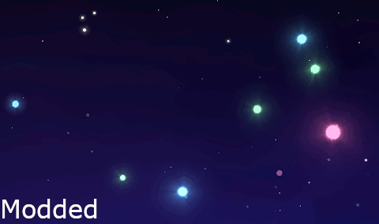
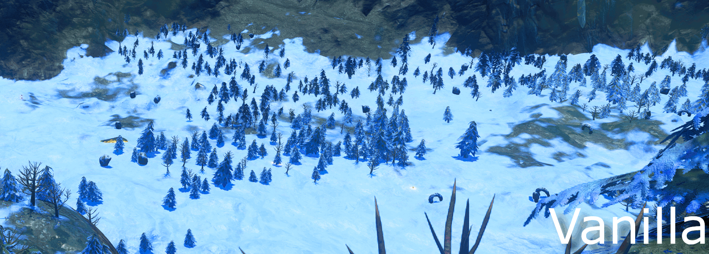
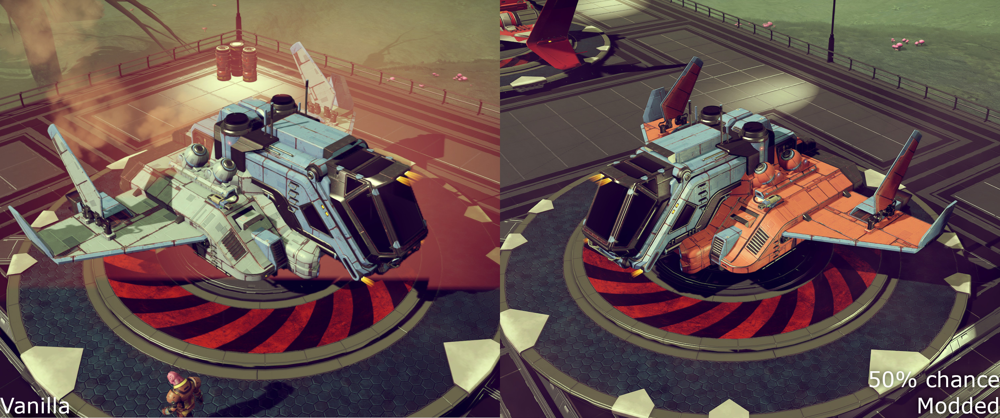
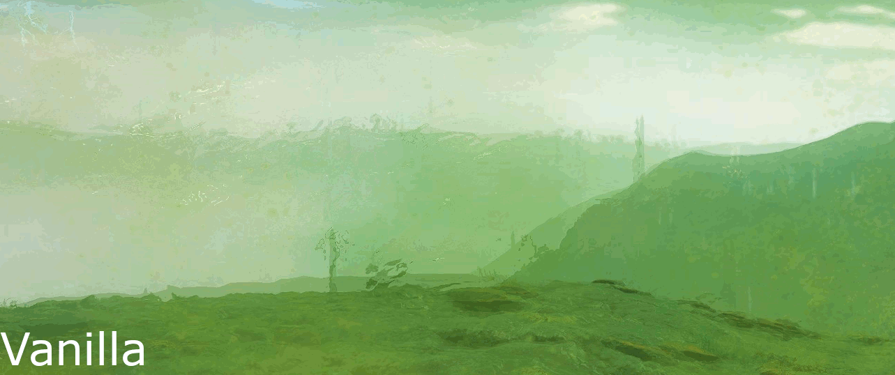
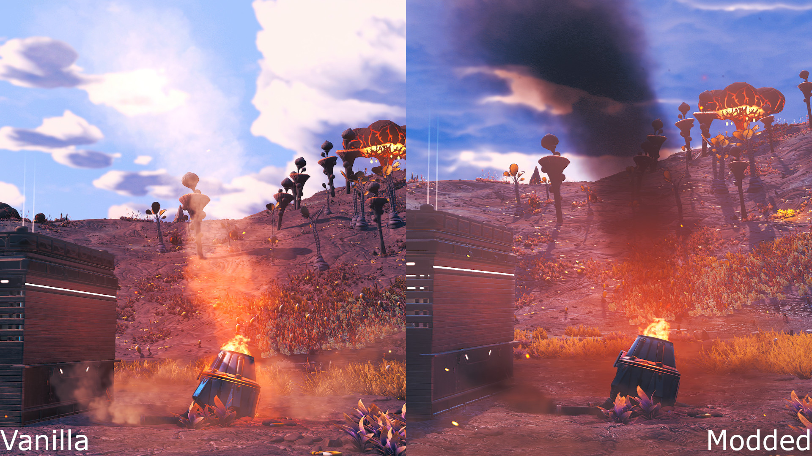

# NoMansSkyLuaMods

To do list:

* Improve bird flock formation
* Add resource rich planets: a small chance that a planet will have one of the typical harvestables for that biome but with much greater coverage.
* Make a hue cycler for water colors
* Try replacing pulse engine speed lines with a refraction map. Distorted space instead of rainbow (maybe keeping a smaller amount of rainbow particles).

## Better Star Colors

## Less Patchy Snow

## More Shuttle Paint Variety

## No Hazard Screen Refraction

## Smoke Not Steam

