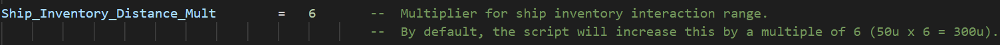
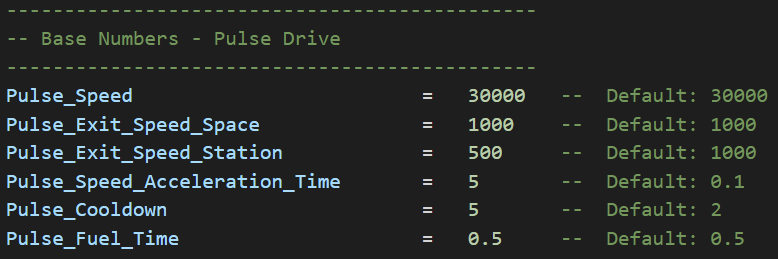

# Hypn0tick Modular Flight Framework

A mod script and framework for No Man's Sky flight-related mods using the [AMUMSS Framework](https://github.com/HolterPhylo/AMUMSS), a LUA script-based mod builder that can build modifications using the game's (and other mods') latest files.

For more information on modding No Man's Sky, using AMUMSS, fixing bugs, and much more, feel free to join the [NMS Modding Discord](https://discord.gg/5Bb3pYYVyV). For LUA script examples, check out the [AMUMSS Standard Collection](https://github.com/MetaIdea/nms-amumss-lua-mod-script-collection/tree/main/amumss-standard-collection), which includes various helpful learning examples, and the general [AMUMSS LUA Mod Script Collection](https://github.com/MetaIdea/nms-amumss-lua-mod-script-collection).

## Overview

This AMUMSS script serves as a framework with which flight-related mods for No Man's Sky can be both created easily by mod authors, and later fine-tuned by users in the simplest possible manner.

This script should allow both mod authors and users to create and share alterations to NMS's flight settings more easily than ever before. Almost every parameter controlling all aspects of flight in No Man's Sky have been mapped out into convenient variables for authors, and even simpler multipliers for users. Further in the Readme, we will go over the script's sections and main functions.

### Features

**NOTE:** The default version of the script enabled most of the features and changes have been made to some base values. All changes can be easily configured in the file. A variant with vanilla values is provided in the repository.

- Modular features that can be enabled/disabled individually.

- Control values using multipliers (simpler) or by inputting base numbers, which will automatically be applied to the correct parameters in the game's files.

- Easily modify space flight parameters (speed, maneuverability, and more).
  
  - Separately modify parameters for space, combat, planetary, and atmospheric flight.
  
  - Disable automatic avoidance & orientation limits.
  
  - Disable "flight assist", which makes ships travel through space as if they were in atmospheric conditions. When disabled, ships will retain their momentum during space travel.
  
  - Modify pulse & warp drive settings.
  
  - Modify asteroid damage.
  
  - Disable asteroid generation when using the pulse drive.
  
  - Disable speed lines during pulse & warp travel.

- Easily modify planetary & atmospheric flight parameters.
  
  - Enable hovering or reversing when flying on planets.
  
  - Enable low or underwater flight.
  
  - Modify ship launch fuel cost.
  
  - Modify ship inventory & teleporter distances.
  
  - Modify ship scanner parameters.

- Easily modify freighter settings.
  
  - Remove multiplayer freighter limit (typically 1 per system).
  
  - Ensure that a system's first freighter spawn will be its capital freighter.
  
  - Modify planetary summon distance & tractor range.
  
  - Modify warp drive ranges & bonuses.

- And more!

## Installation

To begin creating, modifying, and/or building LUA-based mods for No Man's Sky, you will need to follow a few basic steps:

### Install Dependencies

The Modular Flight Framework is a .lua script that uses AMUMSS to create a usable .pak file. Ensure you have [installed AMUMSS and its dependencies](https://github.com/hypn0tick/nms-lua-mods#installing-amumss) correctly to ensure a smooth experience.

### Download the Modular Flight Framework

Download the script to your AMUMSS "ModScript" folder. If you struggle to download the file, simply [copy its contents](https://raw.githubusercontent.com/hypn0tick/nms-lua-mods/master/01%20-%20Hypn0tick%20Mods/Modular%20Flight%20Framework/Hypn0tick%20-%20Modular%20Flight%20Framework.lua) into a new .lua file in your "ModScript" folder.

You are now ready to build LUA script-based mods for No Man's Sky!

**NOTE:** The URL above links to the script with my personal configurations that I have released. If you are looking to build a mod from scratch, please reference the [variant with base-game values](https://github.com/hypn0tick/nms-lua-mods/blob/master/01%20-%20Hypn0tick%20Mods/Modular%20Flight%20Framework/Variants/Vanilla.lua) included in the repository.

### Build the Mod(s)

Now that you have downloaded AMUMSS and the Modular Flight Framework script, turning the script into a useable mod is a very simply process. With its script's .lua file in your AMUMSS "ModScript" folder, simply run "BUILDMOD.bat" to create the mod's .pak file.

When you run AMUMSS, it will ask whether to automatically copy the created .pak file to your NMS "MODS" folder and delete the "DISABLEMODS.txt" file from the game's "PCBANKS" folder. If you choose not to, simply move the newly-created file from the AMUMSS "CreatedModPAKs" folder to the game's "GAMEDATA\PCBANKS\MODS" folder and delete the "GAMEDATA\PCBANKS\DISABLEMODS.txt" file. Your game will now start with the mod enabled.

To build multiple mods created with the Modular Flight Framework, place them all inside the "ModScript" folder and rename the scripts alphabetically so that those you with changes you wish to take priority are loaded last. Otherwise, disable the appropriate features in your scripts so that they do not conflict.

## Creating & Modifying Modular Flight Mods

Before building a Modular Flight Framework mod, you can open its .lua file to configure every aspect of flight in No Man's Sky individually. Specifics regarding the file's data & sections are included below. After making your desired changes, simply build the mod as explained above and enjoy the results in-game.

### Framework Script Contents

To simplify the process of editing the script's data, it has been separated into three different sections: <u>general settings & multipliers, base numbers, and code.</u>

#### General Settings & Multipliers

The "general settings & multipliers" section is likely to be the only one touched by the vast majority of mod users. It primarily contains various booleans (true/false statements) that control the script's features, and multipliers that alter associated values.

<u>**Example Boolean:**</u>

<u>**Example Multiplier:**</u> 

#### Base Numbers

The second section, base numbers, houses all of the default data used by the script and its modifiers. This section exists for mod authors to more easily alter these values without the need to change any code. By modifying this section (as opposed to the first), mod authors also allow their users to more easily tweak their mod's values using the multipliers in the first section without the need to create any code.

<u>**Example Base Numbers:**</u>

#### Code

The final section, code, contains all of the script's logic. While I encourage users and mod authors to peruse the code for the sake of understanding (and potentially help to find any bugs I may have overlooked), changes to this section of the script should be largely unnecessary as everything is controlled by the prior sections.

## Acknowledgements

First and foremost, I would like to thank Babscoole for reviewing my code, inspiring me with their own, and generally being an awesome person. I would also like to send my heartfelt gratitude to the team behind AMUMSS for creating such an amazing tool. Finally, I would also like to thank the following mod authors for their help, inspiration from their own mods, etc.:

- Babscoole

- lMonk

- PodcastPrimate

- WinderTP

- Xen0nex

- Others I am certainly forgetting at the moment
